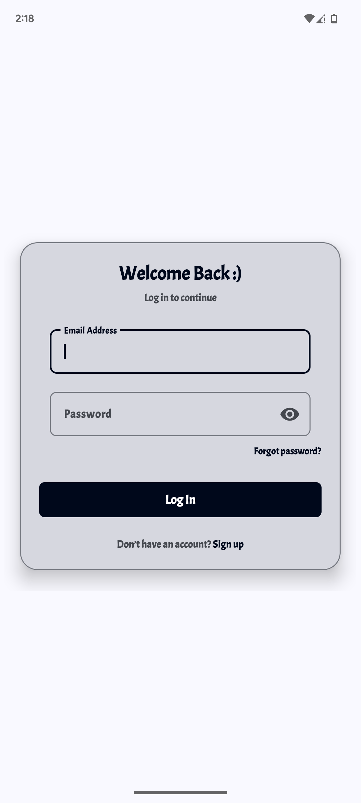
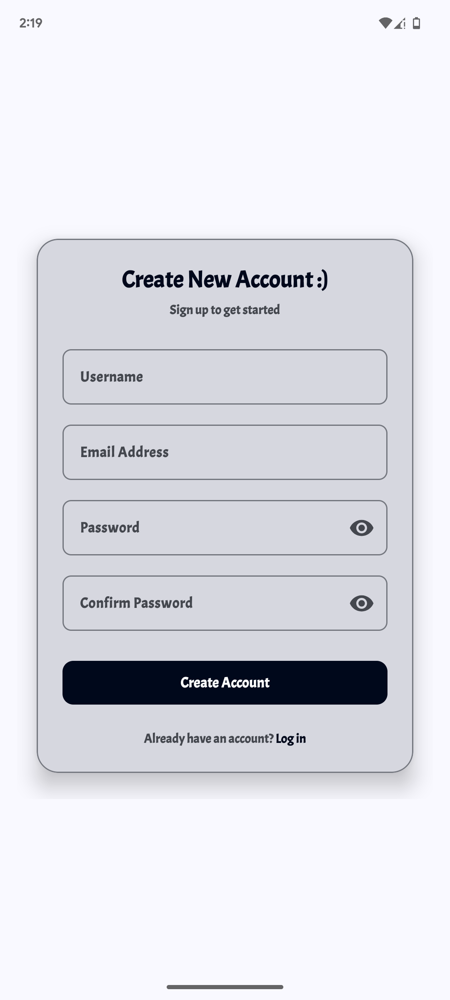
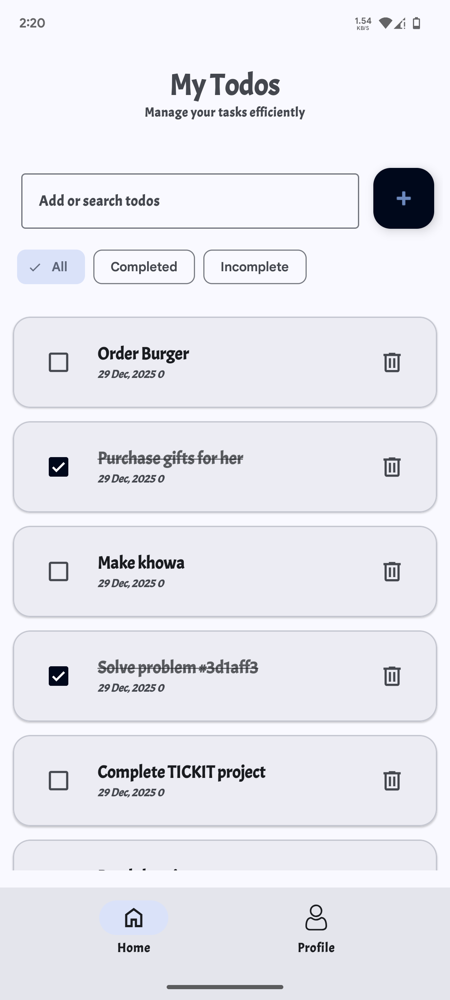
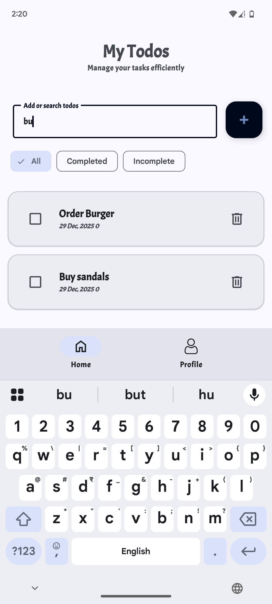
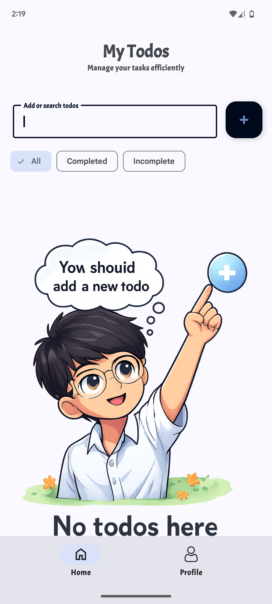
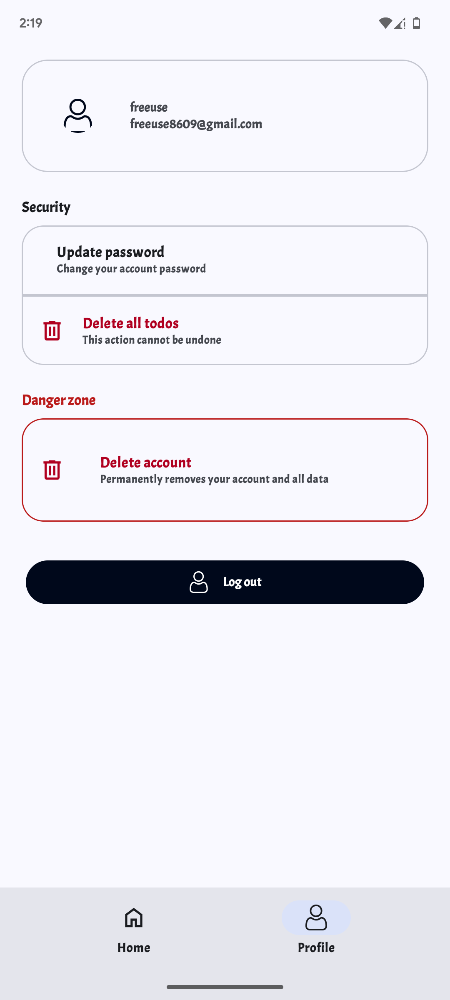

# TickIt 📝
A modern Android Todo application built using **MVVM architecture**, **Firebase**, and **Material 3** to help users manage tasks efficiently.

---

## 🚀 Features
- User Authentication (Sign up / Login)
- Add, update, and delete todos
- Mark todos as completed / incomplete
- Firebase Realtime Database integration
- Clean Material 3 UI
- Empty state illustration when no todos exist
- Secure password update with re-authentication

---

## 📱 Screenshots

| Login | Signup | Home |
|------|--------|------|
|  |  |  |

| Add Todo | Empty State | Profile |
|---------|-------------|---------|
|  |  |  |

> 📌 Screenshots are placed inside the `screenshots/` folder.

---

## 🧠 Architecture
- **MVVM (Model–View–ViewModel)**
- ViewModel handles business logic
- UI observes state changes
- Firebase operations handled using **Kotlin Coroutines**

---

## 🛠 Tech Stack
- **Kotlin**
- **Android Jetpack**
    - ViewModel
    - LiveData / StateFlow
    - DataBinding
- **Firebase**
    - Authentication
    - Realtime Database
- **Material 3**
- **Coroutines**
- **BottomSheetDialog**
- **RecyclerView**

---

## 🔐 Firebase Services Used
- Firebase Authentication (Email & Password)
- Firebase Realtime Database
- Firebase Auth Re-authentication for password updates

---

## ▶️ How to Run the Project
1. Clone the repository
   ```bash
   git clone https://github.com/shubham-8609/TickIt.git

## Author
### Codeleg
### Android Developer
📧 Email: shubhamgupta8609@gmail.com
🐙 GitHub: https://github.com/shubham-8609